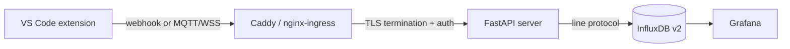

# Self-hosted Server

::: warning Security notice
This configuration has been designed with security in mind: constant-time credential
comparison, non-root containers, rate limiting, mTLS, network policies, and secret
manager integration are all included. That said, this project is maintained by a
developer, not a security engineer, and no independent audit has been performed.

Automated scanning (Trivy, Kubescape, Docker Scout) runs on every CI push, but
tooling is not a substitute for human review. Before deploying to a production
environment with real credentials, please read through the manifests and auth
configuration yourself, or have a qualified person do so.

*The author takes no responsibility for security incidents arising from use of this
software. Please conduct your own due diligence.*
:::

Mallard ships an optional ingest server that receives metric payloads from one or more extension instances, stores them in InfluxDB v2, and visualises them in Grafana. The extension works fine without it. Self-hosting is for teams that want a centralised dashboard or want to keep data under their own control.

Source: `server/` in this repo.

## How it works



The server is a single stateless FastAPI process. It accepts either:
- **Webhook**: a `POST` to `/api/v1/ingest` with an `X-API-Key` header (or `Authorization: Bearer` for token-based auth, or a TLS client certificate for mTLS).
- **MQTT**: a message published over a WebSocket-wrapped MQTT connection (`wss://your-server/mqtt`). The embedded amqtt broker accepts any topic; it doesn't filter by topic name, only by the authenticated client.

InfluxDB stores every snapshot as a measurement named `mallard_metrics`. Grafana reads from InfluxDB via Flux queries and ships four pre-built dashboards: overview, per-model breakdown, team comparison, and velocity trends.

## Secret manager: pick one first

The server requires a secret manager — there is no supported static-credentials-only deployment. Choose Infisical or OpenBao before following the quick start below; the Secret Management guide has a full pros/cons and licensing comparison to help you decide.

| Manager | Docker Compose | Kubernetes |
|---|---|---|
| Infisical | `docker-compose.infisical.yml` overlay | `server/k8s/infisical/` kustomize overlay |
| OpenBao | `docker-compose.openbao.yml` overlay | `server/k8s/openbao/` kustomize overlay |

Either way, the server fetches credentials live and caches them for 30 seconds, so revocation or rotation propagates within one cache interval — no pod restart or container recreate needed.

## Quick start (Docker Compose)

```bash
git clone https://github.com/RedPandaMC/Mallard.git
cd Mallard/server/docker
cp .env.example .env
```

Open `.env` and fill in the base values plus **one** secret manager block (OpenBao or Infisical — comment out the one you're not using):

```bash
# A random token for InfluxDB, generate with: openssl rand -hex 32
INFLUX_TOKEN=change-me

# Grafana admin password
GF_SECURITY_ADMIN_PASSWORD=changeme

# OpenBao block: the initial credential values it seeds on first boot.
# Format: label:key  (the label appears as the "source" tag in InfluxDB)
OPENBAO_DEV_ROOT_TOKEN=change-me-too
API_KEYS=my-machine:change-me-too
```

Then start the stack with the matching overlay:

```bash
docker compose -f docker-compose.yml -f docker-compose.openbao.yml up -d
# or:
docker compose -f docker-compose.yml -f docker-compose.infisical.yml up -d
```

| Service | Local URL |
|---|---|
| Ingest API | `http://localhost/api/v1/ingest` |
| Grafana | `http://localhost/grafana` |
| InfluxDB UI | `http://localhost:8086` |
| OpenBao UI (OpenBao overlay only) | `http://localhost:8200` |
| Infisical UI (Infisical overlay only) | `http://localhost:8888` |

For a **real domain** with automatic HTTPS, set two more variables:

```bash
SERVER_DOMAIN=mallard.your-org.com
ACME_EMAIL=ops@your-org.com
```

Caddy detects a real hostname and obtains a Let's Encrypt certificate automatically. The API then becomes `https://mallard.your-org.com/api/v1/ingest`.

## Connecting the extension

Once the server is running, configure VS Code:

**Webhook (API key), the simplest option:**

```json
"mallard.server.url": "https://mallard.your-org.com",
"mallard.export.transport": "webhook",
"mallard.webhook.auth": "apiKey"
```

Then run **Mallard: Set Webhook API Key** from the Command Palette — credentials
are stored in VS Code's SecretStorage, never in settings files.

**Webhook (Bearer token):**

```json
"mallard.server.url": "https://mallard.your-org.com",
"mallard.export.transport": "webhook",
"mallard.webhook.auth": "bearer"
```

Then run **Mallard: Set Webhook Bearer Token**. The server treats the bearer
token identically to an API key: it is hashed and looked up in the same
`API_KEYS` credential store, so the token value must be registered there — the
server does not validate tokens against an identity provider.

**MQTT (password):**

```json
"mallard.server.url": "https://mallard.your-org.com",
"mallard.export.transport": "mqtt",
"mallard.mqtt.auth": "password",
"mallard.mqtt.username": "alice"
```

Run **Mallard: Set MQTT Export Password** from the Command Palette to store the password securely in VS Code's SecretStorage. Passwords are never written to settings files.

## Named credentials and the `source` tag

Every API key and MQTT credential can carry a **label** (`label:secret`), written as the
`source` tag on every InfluxDB data point. This is what lets you filter Grafana
dashboards by team, machine, or person.

## MQTT configuration

Enable the embedded MQTT broker:

```bash
MQTT_ENABLED=true
```

The broker listens on WebSocket at `/mqtt`. Extension clients connect via `wss://your-server/mqtt`. MQTT credentials are separate from API keys; set both if you use both transports. With the OpenBao overlay, add `MQTT_CREDENTIALS=alice:my-password,bob:other-password` to `.env` alongside `API_KEYS` for the seed step. With Infisical, add an `MQTT_CREDENTIALS` secret in the Infisical UI the same way you add `API_KEYS`.

## Kubernetes

The K8s manifests in `server/k8s/` deploy the full stack to a `mallard` namespace. Prerequisites: a running Kubernetes cluster (1.28+) with an nginx ingress controller.

### 1. Install cert-manager

cert-manager handles TLS certificate lifecycle: it provisions and auto-renews the HTTPS certificate for your ingress, and can issue mTLS client certificates for the extension. It does **not** manage application secrets.

```bash
helm repo add jetstack https://charts.jetstack.io --force-update
helm install cert-manager jetstack/cert-manager \
  --namespace cert-manager --create-namespace --set crds.enabled=true
```

Then apply the ClusterIssuers (ACME + self-signed CA):

```bash
kubectl apply -f server/k8s/cert-manager/
```

### 2. Create the namespace and base secrets

```bash
kubectl apply -f server/k8s/namespace.yaml
cp server/k8s/secrets.yaml.example server/k8s/secrets.yaml
# Edit secrets.yaml, set INFLUX_TOKEN and GF_ADMIN_PASSWORD.
# API_KEYS in this file is dev/test-only — real credentials come from the
# secret manager Secret in step 3, not from here.
kubectl apply -f server/k8s/secrets.yaml
```

> Keep `secrets.yaml` out of version control. It is listed in `.gitignore`.

### 3. Set up your chosen secret manager

Follow `server/k8s/openbao/install.md` or `server/k8s/infisical/README.md` for the manager you picked. Each ends with applying a Secret (`mallard-openbao-secrets` or `mallard-infisical-secrets`) holding the token the server uses to poll that manager.

### 4. Apply manifests

```bash
kubectl apply -f server/k8s/influxdb/
kubectl apply -k server/k8s/openbao/    # or: kubectl apply -k server/k8s/infisical/
kubectl apply -f server/k8s/grafana/
kubectl apply -f server/k8s/ingress.yaml
```

Apply the server via the secret manager overlay (`kubectl apply -k ...`), not `kubectl apply -f server/k8s/server/` directly — the overlay patches in the `SECRET_MANAGER_TYPE`/`SECRET_MANAGER_URL` environment the server requires to start at all.

The ingress watches for a cert from the `letsencrypt-prod` ClusterIssuer and populates the TLS secret automatically once cert-manager issues it (usually within 60 seconds).

### High-availability

The server Deployment ships with `replicas: 2` (HPA min=2, max=10), a PodDisruptionBudget of `minAvailable: 1`, and resource limits. Rolling updates are zero-downtime by default.

**Credential rotation without restart (Stakater Reloader):**

```bash
helm install reloader stakater/reloader --namespace reloader --create-namespace
```

The server Deployment carries the `reloader.stakater.com/auto: "true"` annotation, so updating `mallard-server-secrets` or the `mallard-server-config` ConfigMap triggers a zero-downtime rolling restart automatically. Rotating the actual API keys or MQTT passwords in Infisical/OpenBao itself needs no restart at all — the server picks them up on its next 30-second poll. Only rotating the secret manager's own access token (`mallard-openbao-secrets` / `mallard-infisical-secrets`) needs the pod to pick up new env vars, which Reloader also handles.

## mTLS: client certificate auth (optional)

Instead of API keys or passwords, the extension can authenticate with a TLS client
certificate. The certificate's Common Name becomes the `source` tag in InfluxDB, no
separate credential entry needed. Requires cert-manager with the `mallard-ca`
ClusterIssuer and the nginx mTLS annotations already in `server/k8s/ingress.yaml`.
