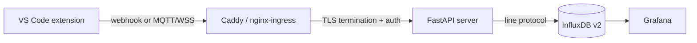

# Self-hosted Server

::: warning Security notice
This configuration has been designed with security in mind — constant-time credential
comparison, non-root containers, rate limiting, mTLS, network policies, and secret
manager integration are all included. That said, this project is maintained by a
developer, not a security engineer, and no independent audit has been performed.

Automated scanning (Trivy, Kubescape, Docker Scout) runs on every CI push, but
tooling is not a substitute for human review. Before deploying to a production
environment with real credentials, please read through the manifests and auth
configuration yourself, or have a qualified person do so.

*The author takes no responsibility for security incidents arising from use of this
software. Please conduct your own due diligence.*
:::

Mallard ships an optional ingest server that receives metric payloads from one or more extension instances, stores them in InfluxDB v2, and visualises them in Grafana. The extension works fine without it — self-hosting is for teams that want a centralised dashboard or want to keep data under their own control.

Source: `server/` in this repo.

## How it works



The server is a single stateless FastAPI process. It accepts either:
- **Webhook** — a `POST` to `/api/v1/ingest` with an `X-API-Key` header (or `Authorization: Bearer` for token-based auth, or a TLS client certificate for mTLS).
- **MQTT** — a message published to `mallard/metrics` over a WebSocket-wrapped MQTT connection (`wss://your-server/mqtt`). The embedded amqtt broker runs inside the same process.

InfluxDB stores every snapshot as a measurement named `mallard_metrics`. Grafana reads from InfluxDB via Flux queries and ships four pre-built dashboards: overview, per-model breakdown, team comparison, and velocity trends.

## Quick start (Docker Compose)

The fastest path to a running server — everything in one `compose up`.

```bash
git clone https://github.com/RedPandaMC/Mallard.git
cd Mallard/server/docker
cp .env.example .env
```

Open `.env` and set three required values:

```bash
# A random token for InfluxDB — generate with: openssl rand -hex 32
INFLUX_TOKEN=change-me

# One or more API keys, comma-separated.
# Format: label:key  (the label appears as the "source" tag in InfluxDB)
API_KEYS=my-machine:change-me-too

# Grafana admin password
GF_SECURITY_ADMIN_PASSWORD=changeme
```

Then start the stack:

```bash
docker compose up -d
```

| Service | Local URL |
|---|---|
| Ingest API | `http://localhost/api/v1/ingest` |
| Grafana | `http://localhost/grafana` |
| InfluxDB UI | `http://localhost:8086` |

For a **real domain** with automatic HTTPS, set two more variables:

```bash
SERVER_DOMAIN=mallard.your-org.com
ACME_EMAIL=ops@your-org.com
```

Caddy detects a real hostname and obtains a Let's Encrypt certificate automatically. The API then becomes `https://mallard.your-org.com/api/v1/ingest`.

## Connecting the extension

Once the server is running, configure VS Code:

**Webhook (API key) — the simplest option:**

```json
"mallard.server.url": "https://mallard.your-org.com",
"mallard.export.transport": "webhook",
"mallard.webhook.auth": "apiKey",
"mallard.webhook.apiKey": "change-me-too"
```

**Webhook (Bearer token) — useful when your identity provider issues tokens:**

```json
"mallard.server.url": "https://mallard.your-org.com",
"mallard.export.transport": "webhook",
"mallard.webhook.auth": "bearer",
"mallard.webhook.bearerToken": "eyJhbGc..."
```

The server treats the bearer token identically to an API key — it is hashed and looked up in the same credential store. This lets you use a machine token issued by Infisical or OpenBao directly in the extension without a separate `API_KEYS` entry.

**MQTT (password):**

```json
"mallard.server.url": "https://mallard.your-org.com",
"mallard.export.transport": "mqtt",
"mallard.mqtt.auth": "password",
"mallard.mqtt.username": "alice"
```

Run **Mallard: Set MQTT Export Password** from the Command Palette to store the password securely in VS Code's SecretStorage. Passwords are never written to settings files.

See [Settings reference](/reference/settings) for the full list of extension settings and the payload schema.

## Named credentials and the `source` tag

Every API key and MQTT credential can carry a **label**. The label is written as the `source` tag on every InfluxDB data point, which lets you filter Grafana dashboards by team, machine, or person.

Format: `label:secret` (comma-separated for multiple):

```bash
# .env
API_KEYS=alice:key-abc123,bob:key-def456,ci-pipeline:key-ghi789
MQTT_CREDENTIALS=alice:mqtt-pass1,ci-pipeline:mqtt-pass2
```

If you don't provide a label (bare key, no colon), the source tag is `"unknown"`.

Querying by source in Flux:

```flux
from(bucket: "metrics")
  |> range(start: -7d)
  |> filter(fn: (r) => r["source"] == "alice")
```

## MQTT configuration

Enable the embedded MQTT broker in `.env`:

```bash
MQTT_ENABLED=true
MQTT_CREDENTIALS=alice:my-password,bob:other-password
```

The broker listens on WebSocket at `/mqtt`. Extension clients connect via `wss://your-server/mqtt`.

> **Note:** MQTT credentials are separate from API keys — set both `API_KEYS` and `MQTT_CREDENTIALS` if you use both transports.

## Kubernetes

The K8s manifests in `server/k8s/` deploy the full stack to a `mallard` namespace. Prerequisites: a running Kubernetes cluster (1.28+) with an nginx ingress controller.

### 1 — Install cert-manager

cert-manager handles TLS certificate lifecycle: it provisions and auto-renews the HTTPS certificate for your ingress, and can issue mTLS client certificates for the extension. It does **not** manage application secrets — that is covered by [Infisical or OpenBao](/guide/secret-management).

```bash
helm repo add jetstack https://charts.jetstack.io --force-update
helm install cert-manager jetstack/cert-manager \
  --namespace cert-manager --create-namespace --set crds.enabled=true
```

Then apply the ClusterIssuers (ACME + self-signed CA):

```bash
kubectl apply -f server/k8s/cert-manager/
```

See [cert-manager guide](/guide/cert-manager) for issuer selection, self-signed vs Let's Encrypt, and mTLS client certificate provisioning.

### 2 — Create the namespace and secrets

```bash
kubectl apply -f server/k8s/namespace.yaml
cp server/k8s/secrets.yaml.example server/k8s/secrets.yaml
# Edit secrets.yaml — set INFLUX_TOKEN, API_KEYS, MQTT_CREDENTIALS, GF_ADMIN_PASSWORD
kubectl apply -f server/k8s/secrets.yaml
```

> Keep `secrets.yaml` out of version control — it is listed in `.gitignore`.

### 3 — Apply manifests

```bash
kubectl apply -f server/k8s/influxdb/
kubectl apply -f server/k8s/server/
kubectl apply -f server/k8s/grafana/
kubectl apply -f server/k8s/ingress.yaml
```

The ingress watches for a cert from the `letsencrypt-prod` ClusterIssuer and populates the TLS secret automatically once cert-manager issues it (usually within 60 seconds).

### High-availability

The server Deployment ships with `replicas: 2` (HPA min=2, max=10), a PodDisruptionBudget of `minAvailable: 1`, and resource limits. Rolling updates are zero-downtime by default.

**Credential rotation without restart (Stakater Reloader):**

```bash
helm install reloader stakater/reloader --namespace reloader --create-namespace
```

The server Deployment carries the `reloader.stakater.com/auto: "true"` annotation. When you update the `mallard-server-secrets` Secret (e.g. rotate an API key), Reloader triggers a zero-downtime rolling restart automatically.

## Dynamic credentials (optional)

Instead of storing credentials in a Kubernetes Secret or `.env` file, you can pull them from a self-hosted secret manager. The server fetches credentials on first request and caches them for 30 seconds, so revocation propagates within one cache interval.

Two secret managers are supported:

| Manager | Purpose | Docker Compose | Kubernetes |
|---|---|---|---|
| Infisical | Full-featured secret management platform | `docker-compose.infisical.yml` overlay | `server/k8s/infisical/` kustomize overlay |
| OpenBao | HashiCorp Vault fork (community-maintained) | `docker-compose.openbao.yml` overlay | `server/k8s/openbao/` kustomize overlay |

See the [Secret Management guide](/guide/secret-management) for detailed setup steps for both providers.

## mTLS — client certificate auth (optional)

Instead of API keys or passwords, the extension can authenticate with a TLS client certificate. The certificate's Common Name becomes the `source` tag in InfluxDB — no separate credential entry needed.

Requires:
- cert-manager with the `mallard-ca` ClusterIssuer (see [cert-manager guide](/guide/cert-manager))
- The nginx mTLS annotations already in `server/k8s/ingress.yaml`

Configure the extension:

```json
"mallard.server.url": "https://mallard.your-org.com",
"mallard.export.transport": "webhook",
"mallard.webhook.auth": "certificate",
"mallard.shared.certificate.file": "/home/alice/.certs/alice.crt",
"mallard.shared.certificate.keyFile": "/home/alice/.certs/alice.key",
"mallard.shared.certificate.caFile": "/home/alice/.certs/mallard-ca.crt"
```

See [cert-manager guide — client certs](/guide/cert-manager#client-certificates) for how to issue and distribute client certificates per team member.
